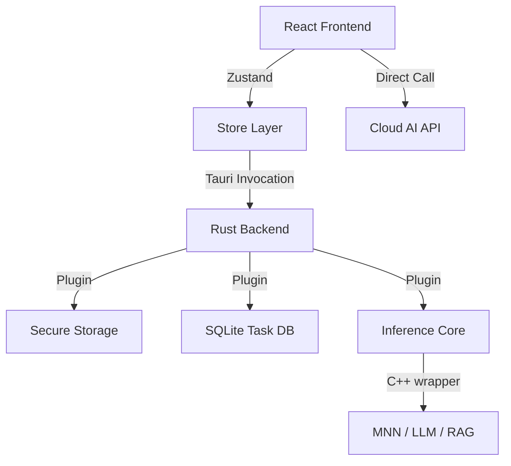

# TaskPilot

<p align="center">
  <strong>基于端云协同与动态优先级的智能日程规划专家</strong>
</p>

<p align="center">
  
  
  
  
</p>

TaskPilot 是一款专为高效工作者设计的端云协同日程规划工具。它通过自研的**动态优先级算法**实时调整任务紧迫度，并结合**端侧大模型推理**技术，提供既隐私安全又智能的规划体验。

---

## ✨ 核心特性

### 1. 🚀 智能动态优先级 (Dynamic Priority)

不同于传统的静态优先级（高/中/低），TaskPilot 采用多维计算公式实时更新任务权重：

- **权重组合**：基础重要度 (40%) + 时间紧迫度 (35%) + 进度偏离惩罚 (25%) + 超时补偿 (0-20分)。
- **核心逻辑**：自动提升落后于计划或接近截止日期的任务优先级，确保您永远在处理“最重要且最紧迫”的事项。
- 详情请参阅：[算法详解文档](docs/DYNAMIC_PRIORITY_LOGIC.md)

### 2. 🧠 端云协同 AI 指标

- **云端强引擎**：集成 OpenAI GPT 系列模型，处理复杂的长周期规划、多维月报生成。
- **端侧轻推理**：
  - **自研核心**：[tauri-plugin-taskpilot-inference](tauri-plugin-taskpilot-inference/README.md) 插件。
  - **推理引擎**：底层基于高性能 C++ [InferenceCore](tauri-plugin-taskpilot-inference/taskPilot-InferrenceCore/README.md)，适配 MNN 框架。
  - **本地模型**：支持 Qwen2.5 (1.5B/7B) 等本地 LLM，实现秒级离线对话。
  - **RAG 增强**：支持本地向量数据库，基于您的历史计划进行知识检索。

### 3. 📅 深度任务管理

- **计划与阶段**：支持长周期 Plan 嵌套细分 Task。
- **多维视图**：看板式 Todo 列表、直观的日历单元格视图、进度热力图。
- **专注工具**：内置番茄钟、计时器，自动统计任务耗时进行量化分析。

### 4. 🔒 隐私与跨平台

- **零信任存储**：API Key 使用系统级 [tauri-plugin-secure-storage](tauri-plugin-secure-storage/README.md) 插件进行加密存储，确保敏感信息安全。
- **数据本地化**：任务数据完全存储在本地 SQLite 数据库中，支持离线操作与即时响应。
- **全平台支持**：得益于 Tauri v2，原生支持 Android、iOS 以及主流桌面操作系统（Windows, macOS, Linux）。

---

## 📱 功能详解

### 1. 🤖 智能 AI 规划助手

_TaskPilot 不仅仅是一个列表，更是一个懂你的助手。_

- **多模态输入**：支持通过文字描述、语音指令或拍摄纸质计划照片来快速生成数字化日程。
- **自动化拆解**：只需输入一个长期目标（如“准备下个月的考试”），AI 会自动将其拆解为每日可执行的目标。
- **端侧灵活性**：可随时切换云端（GPT-4等）与本地（Qwen-MNN）推理引擎，平衡响应速度与数据隐私。

### 2. 🔥 动态优先级系统

_让您的列表随着时间的推移而“变重”。_

- **实时权重计算**：系统每分钟重新计算各项任务的优先级。
- **进度落后惩罚**：如果计划内任务完成率低于时间进度，系统将自动通过权重加成提醒用户关注。
- **超时任务直达**：主页面悬浮通知栏实时抓取“严格模式”下的逾期任务，确保不再遗漏。

### 3. ⏱️ 沉浸式专注体验

_内置科学的时间管理工具。_

- **鹦鹉螺 (Nautilus) 计时器**：精美的番茄钟界面，支持 Focus、Short Break 及 Long Break 三种模式。
- **循环专注流**：支持自动化循环模式，一次开启即可自动流转多个专注周期。
- **量化统计**：自动记录每个任务的实际耗时，为后续的月度分析提供真实数据。

### 4. 📊 深度量化分析

_用数据驱动的自我改进。_

- **AI 月度总结**：一键生成结构化月报，涵盖本月成就总结、挑战分析及下月改进建议。
- **任务热力图**：通过可视化的方式展示您的时间分配与生产力波动。
- **智能资源推荐**：基于您当天的任务内容，AI 助手会智能推荐相关的学习或工作资源。

### 5. 📅 全方位日程管理

- **精美日历视图**：支持点击日期快速定位任务，清晰展示各阶段计划的起止范围。
- **极简 Todo 面板**：支持侧滑快捷操作、任务状态即时同步至本地 SQLite。

---

## 🏗️ 架构概览



## 📂 目录结构

```text
taskPilot/
├── src/                # React 前端 (TypeScript)
├── src-tauri/          # Tauri 后端 (Rust)
├── docs/               # 技术文档汇总
├── tauri-plugin-taskpilot-inference/  # 端侧推理插件 (Rust)
│   └── taskPilot-InferrenceCore/      # 推理引擎核心 (C++)
└── tauri-plugin-secure-storage/       # 安全存储插件 (Android 加密存储)
```

---

## 🛠️ 技术栈

| 维度           | 技术选型                                   |
| :------------- | :----------------------------------------- |
| **前端框架**   | React 18 + TypeScript + Vite               |
| **跨平台容器** | Tauri v2 (Rust Backend)                    |
| **UI 组件库**  | TDesign Mobile + Ant Design Mobile         |
| **状态管理**   | Zustand 5.0                                |
| **数据存储**   | SQLite (tauri-plugin-sql) + Secure Storage |
| **推理模型**   | MNN (C++ API) + Embedding-bge + Qwen2.5    |

---

## 🚀 快速启动

### 1. 准备环境

- **Rust**: `1.77.2+`
- **Node.js**: `LTS`
- **Android**: Android SDK (API 34+), NDK `r25+`

### 2. 获取代码

```bash
git clone --recursive https://github.com/chuanshanjia666/taskPilot.git
cd taskPilot
npm install
```

### 3. 本地模型配置 (以 Android 为例)

TaskPilot 默认从 `/data/local/tmp/models` 读取模型，请执行以下操作：

```bash
# 推送模型文件夹（需包含 config.json 和 .mnn 文件）
adb push your_model_path/Qwen2.5-1.5B-MNN /data/local/tmp/models/
```

### 4. 开发调试

- **桌面端**: `npm run tauri dev`
- **安卓端**: `npm run tauri android dev`
- **iOS端**: `npm run tauri ios dev`

---

## 📖 相关文档

- [动态优先级实现逻辑详解](docs/DYNAMIC_PRIORITY_LOGIC.md)
- [端侧推理核心 (C++ Core) 详解](tauri-plugin-taskpilot-inference/taskPilot-InferrenceCore/README.md)
- [核心推理引擎 C 接口说明](tauri-plugin-taskpilot-inference/taskPilot-InferrenceCore/INTERFACE_README.md)
- [安全存储插件使用指南](tauri-plugin-secure-storage/README.md)
