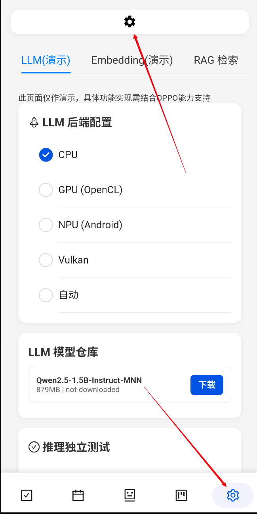
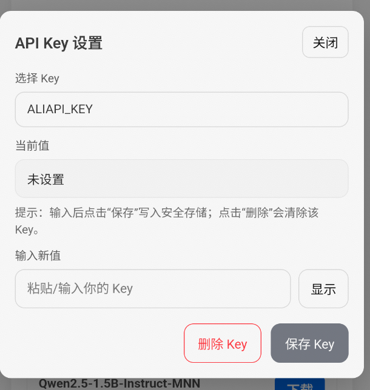
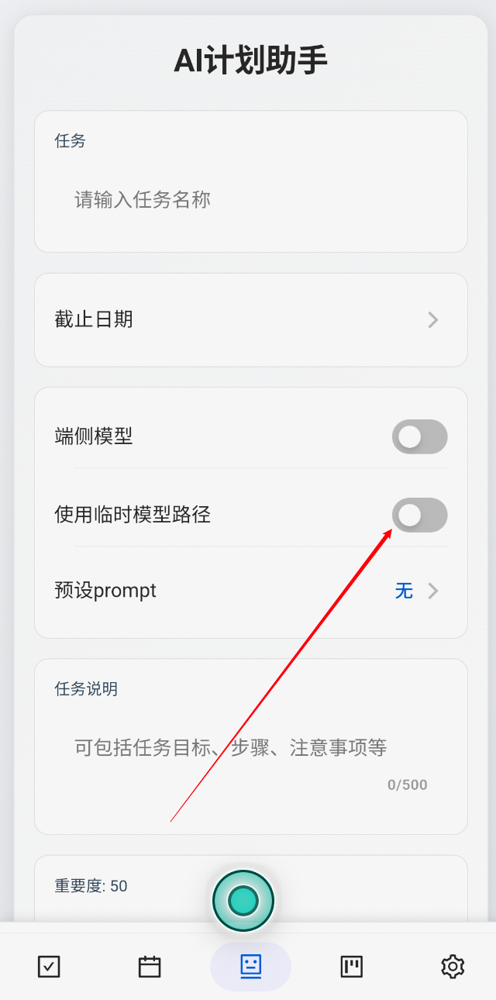

# TaskPilot

## 快速启动

直接安装发行版本安卓应用至手机或虚拟机即可正常运行。

本项目云端能力使用阿里百炼平台与博查 API，需配合平台密钥调用云端能力，请在应用如图位置填写 API 密钥，以保证软件功能的正常使用。

> API 密钥会通过安卓系统进行加密，无解包泄密风险





应用原型内部并未内置端侧模型，对于经过团队内部验证的端侧模型，需自行前往应用“模型管理页面”进行下载。需下载 LLM 模型以启用端侧语言能力，下载 Embedding 模型启用 RAG能力。

若模拟器环境受限或网络环境限制，可参考从源码构建一节中的方法，从脚本中下载模型，并使用 adb 推送模型数据至临时路径。

若使用临时路径，需在软件中启用临时路径功能。



## 从源码构建

如需快速下载测试模型，可跳转至**模型安装**章节

### 环境要求

具体细节可参考[前置要求|Tauri](https://v2.tauri.app/zh-cn/start/prerequisites/)。

- 系统依赖项

  - Linux（以 Debian 为例）

    - ```
      sudo apt update
      sudo apt install libwebkit2gtk-4.1-dev \
        build-essential \
        curl \
        wget \
        file \
        libxdo-dev \
        libssl-dev \
        libayatana-appindicator3-dev \
        librsvg2-dev
      ```

  - macOS：需安装Xcode。

  - Windows：需安装 Microsoft C++ 生成工具安装程序，并下载“使用 C++ 桌面开发”

    - Windows还需确保系统中有 WebView2 环境（Win10 以上自带）。

- Rust：1.88.0 及以上版本。

- Node.js：22.18.0 及以上版本。

- Android：需要 Android Stuidio。

  - 需要`JAVA_HOME`环境变量：`export JAVA_HOME="/Applications/Android Studio.app/Contents/jbr/Contents/Home"`

  - 需要 SDK Manager 中以下内容

    - Android SDK Platform
    - Android SDK Platform-Tools
    - NDK（Side by Side）
    - Android SDK Build-Tools
    - Android SDK Command-line Tools

  - 需要`ANDROID_HOME`和`NDK_HOME`环境变量：

    - ```
      export ANDROID_HOME="$HOME/Library/Android/sdk"
      export NDK_HOME="$ANDROID_HOME/ndk/$(ls -1 $ANDROID_HOME/ndk)"
      ```

  - 添加 Android 编译目标：`rustup target add aarch64-linux-android armv7-linux-androideabi i686-linux-android x86_64-linux-android`

- CMake：4.2.1 及以上。

- Ninja：1.13.2及以上。

### 模型安装

正常环境下，通过软件自动的模型管理功能即可安装并使用端侧 LLM 和 Embedding 模型。

为应对测试环境，系统也提供了临时测试路径。

首先，使用项目`tauri-plugin-taskpilot-inference/taskPilot-InferrenceCore/models/download.py`脚本下载需要的 LLM 和 Embedding 模型。

然后，使用 adb 命令将模型推送至`data/local/tmp`文件夹，此文件夹无需 Root 权限即可读写。

```
adb push "./tauri-plugin-taskpilot-inference/taskPilot-InferrenceCore/models/models/" "/data/local/tmp/"
```

### 构建命令

> 竞赛阶段，项目仓库为私有仓库，涉及远程库以及子仓库的命令可以忽视，但仍需下载前端依赖

初始化源码：

```
# 拉取仓库
git clone --recurse-submodules https://github.com/chuanshanjia666/taskPilot-InferrenceCore.git
 
 # 下载前端依赖
 npm i
```

启用热调试：

```
npm run tauri android dev
```

构建安装包：

```
npm run tauri android build -- --target aarch64
```

若需要构建 Release 或签名出现问题，请参考[安卓代码签名|Tauri](https://v2.tauri.app/zh-cn/distribute/sign/android/)

## 相关文档

- [动态优先级算法详解](docs/DYNAMIC_PRIORITY_LOGIC.md)
-  [端侧推理插件集成指南](docs/INFERENCE_PLUGIN.md)
- [端侧推理核心 (C++) 开发规范](docs/INFERENCE_CORE.md)
-  [推理核心 C 接口文档](docs/INFERENCE_INTERFACE.md)
-  [安全存储插件使用指南](docs/SECURE_STORAGE.md)