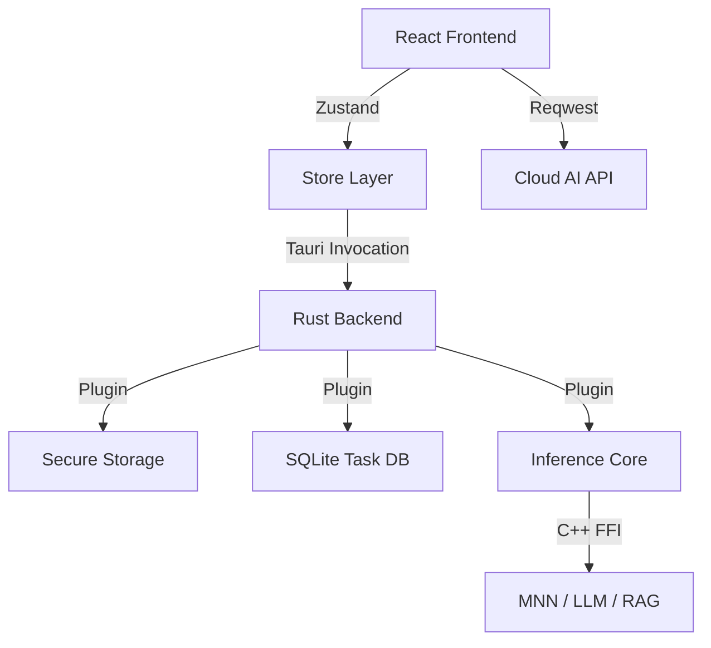

# TaskPilot

<p align="center">
  <strong>基于端云协同与动态优先级的智能日程规划专家</strong>
</p>

<p align="center">
  
  
  
  
</p>

TaskPilot 是一款专为高效工作者设计的端云协同日程规划工具。它通过自研的**动态优先级算法**实时调整任务紧迫度，并结合**端侧推理 (On-device AI)** 与**云端大模型 (Cloud AI)** 技术，在保障用户隐私的同时提供极致的智能化规划体验。

---

## ✨ 核心特性

### 1. 🚀 智能动态优先级 (Dynamic Priority)

不同于传统的静态优先级（高/中/低），TaskPilot 采用多维加权算法实时更新任务权重：

- **多维评分体系**：
  - **基础重要度 (40%)**：保留用户主观意志。
  - **时间紧迫度 (35%)**：基于截止日期的非线性递减评分。
  - **进度偏离惩罚 (25%)**：实时对比预期与实际进度，自动提升落后任务的权重。
  - **超时额外补偿 (0-20分)**：针对已逾期任务进行阶梯式提权。
- **核心逻辑**：自动筛选“重要且紧迫”的事项，确保护航关键目标。

### 2. 🧠 端云协同 AI 推理体系

TaskPilot 提供灵活的端云协同方案，满足不同场景下的性能与隐私需求：

- **云端强引擎 (Cloud AI)**：
  - **深度规划**：接入 Aliyun DashScope (Qwen-Plus/Max)，处理复杂的长周期计划拆解。
  - **多模态感知**：支持语音指令识别 (Qwen-ASR) 与图像内容解析 (Qwen-VL)。
  - **智能搜索**：整合 Bocha Web Search 实时资讯，并基于 Rerank 算法对结果进行精选。

- **端侧轻推理 (On-device AI)**：
  - **推理引擎**：底层基于高性能 C++ 推理框架 MNN，支持 CPU/GPU/NPU 加速，移动端友好。
- **本地模型管理**：支持在线下载及管理多种本地 LLM 和 Embedding 模型。用户可以根据设备性能，自由选择并激活不同的模型后端，实现个性化的离线 AI 体验。
  - **知识增强 (RAG)**：内置本地向量数据库，支持文档 Embedding 与语义检索，拒绝规划泛泛而谈。
  - **MCP 服务**：支持 MCP 协议，大模型可自行查阅本地 RAG 知识库。
- **工作流协同**：精心设计每一个节点的提示词并进行模型微调，实现高质量任务安排。
  

### 3. 📅 深度任务管理

- **分层结构**：支持长周期 Plan 嵌套细分 Task，逻辑清晰。
- **多维视图**：看板式 Todo 列表、直观的日历单元格视图。
- **专注工具**：内置番茄钟、计时器，自动统计任务耗时并进行量化分析。

### 4. 🔒 隐私与跨平台

- **零信任存储**：API Key 使用系统级 `tauri-plugin-secure-storage` 插件，硬件级加密存储。
- **数据本地化**：任务数据完全存储在本地 SQLite 数据库中，支持离线操作与即时响应。
- **全平台支持**：得益于 Tauri v2，原生支持 Android、iOS 以及桌面端 (Windows, macOS, Linux)。

## 📱 功能详解

### 1. 🤖 智能 AI 规划助手

_TaskPilot 不仅仅是一个列表，更是一个懂你的助手。_

- **多模态输入**：支持通过文字描述、语音指令或拍摄纸质计划照片来快速生成数字化日程。
- **自动化拆解**：只需输入一个长期目标（如“准备下个月的考试”），AI 会自动将其拆解为每日可执行的目标。
- **端侧灵活性**：可随时切换云端与本地推理引擎，平衡响应速度与数据隐私。

### 2. 🔥 动态优先级系统

_让您的列表随着时间的推移而“变重”。_

- **实时权重计算**：系统每分钟重新计算各项任务的优先级。
- **进度落后惩罚**：如果计划内任务完成率低于时间进度，系统将自动通过权重加成提醒用户关注。
- **超时任务直达**：主页面悬浮通知栏实时抓取“严格模式”下的逾期任务，确保不再遗漏。

### 3. ⏱️ 沉浸式专注体验

_内置科学的时间管理工具。_

- **计时器**：精美的番茄钟界面，支持 Focus、Short Break 及 Long Break 三种模式。
- **循环专注流**：支持自动化循环模式，一次开启即可自动流转多个专注周期。

### 4. 📊 深度量化分析

_用数据驱动的自我改进。_

- **AI 月度总结**：一键生成结构化月报，涵盖本月成就总结、挑战分析及下月改进建议。
- **任务热力图**：通过可视化的方式展示您的时间分配与生产力波动。
- **智能资源推荐**：基于您当天的任务内容，AI 助手会智能推荐相关的学习或工作资源。

### 5. � 本地模型工厂与管理

_随心所欲，打造您的私有 AI 环境。_

- **一键模型下载**：内置模型市场，支持从 ModelScope 等源一键下载预训练和微调过的 MNN 优化模型。
- **灵活模型切换**：支持多种 LLM（如 Qwen2.5 系列）与 Embedding 模型共存，用户可根据任务需求动态切换。
- **硬件加速选择**：根据设备情况手动选择 CPU、GPU 或 NPU (Android) 作为推理后端。

### 6. �📅 全方位日程管理

- **精美日历视图**：支持点击日期快速定位任务，清晰展示各阶段计划的起止范围。
- **极简 Todo 面板**：支持侧滑快捷操作、任务状态即时同步至本地 SQLite。

## 🔌子仓库与插件说明

TaskPilot 由多个核心组件构成，通过 Tauri 插件机制实现高性能的端侧能力：

- **[tauri-plugin-taskpilot-inference](docs/INFERENCE_PLUGIN.md)**:
  集成端侧 AI 推理能力的 Tauri 插件。它封装了底层 C++ 推理引擎，向前端提供 LLM 对话、文本向量化（Embedding）以及 RAG（检索增强生成）等核心 API。
- **[tauri-plugin-secure-storage](docs/SECURE_STORAGE.md)**:
  基于 Android `EncryptedSharedPreferences` 实现的安全存储插件。用于硬件级加密保護用户的 API Key 及其他敏感配置信息。
- **[taskPilot-InferrenceCore](docs/INFERENCE_CORE.md)**:
  高性能 C++ 推理核心库。基于 MNN 框架开发，支持多后端硬件加速（CPU/GPU/NPU），提供标准 [C API 接口](docs/INFERENCE_INTERFACE.md)。

---

## 🏗️ 架构概览




## 📂 目录结构

```text
taskPilot/
├── src/                # React 前端 (TypeScript)
├── src-tauri/          # Tauri 后端 (Rust 命令与系统集成)
├── tauri-plugin-taskpilot-inference/  # 端侧推理插件 (Rust)
│   └── taskPilot-InferrenceCore/      # 推理引擎核心 (C++)
├── tauri-plugin-secure-storage/       # 安全存储插件 (系统级加密)
└── docs/               # 详细设计与实现文档汇总
```

---

## 🛠️ 技术栈

| 维度           | 技术选型                                    |
| :------------- | :------------------------------------------ |
| **核心框架**   | Tauri v2 + React 18 + Vite                  |
| **后端语言**   | Rust + C++ (Inference Core)                 |
| **前端 UI**    | TDesign Mobile + Ant Design Mobile          |
| **状态管理**   | Zustand 5.0                                 |
| **数据持久化** | SQLite (tauri-plugin-sql) + Secure Storage  |
| **推理技术**   | MNN + Embedding-bge + RAG (Local Vector DB) |
| **网络通信**   | Reqwest (Rust) + Aliyun DashScope           |

---

## 🚀 快速启动

### 1. 准备环境

- **Rust**: `1.77.2+`
- **Node.js**: `v18+`
- **Android**: Android SDK (API 34+), NDK `r25+`

### 2. 获取代码

```bash
git clone --recursive https://github.com/chuanshanjia666/taskPilot.git
cd taskPilot
npm install
```

### 3. 本地模型配置

TaskPilot 现已支持**模型自动下载**功能。您也可以通过以下方式手动配置：

- **自动化获取**：启动应用后，进入“本地模型”页面，从列表中选择并下载所需的 LLM 或 Embedding 模型。
- **手动侧载 (以 Android 为例)**：
  ```bash
  # 推送模型文件夹（需包含 config.json 和 .mnn 文件）
  adb push your_model_path/Qwen2.5-1.5B-MNN /data/local/tmp/models/
  ```

### 4. 开发调试

- **桌面端**: `npm run tauri dev`
- **移动端**: `npm run tauri [android|ios] dev`

---

## 📖 深入了解

- 📚 [动态优先级算法详解](docs/DYNAMIC_PRIORITY_LOGIC.md)
- 🧠 [端侧推理插件集成指南](docs/INFERENCE_PLUGIN.md)
- ⚙️ [端侧推理核心 (C++) 开发规范](docs/INFERENCE_CORE.md)
- 🔌 [推理核心 C 接口文档](docs/INFERENCE_INTERFACE.md)
- 🛡️ [安全存储插件使用指南](docs/SECURE_STORAGE.md)
